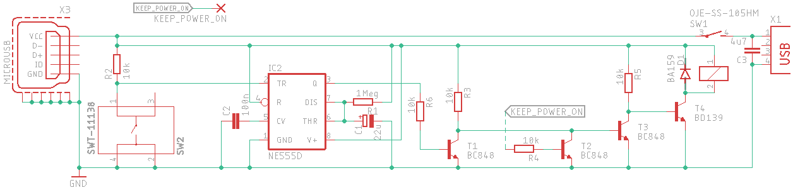

# raspberry_switch
A switch to turn on and truly turn off raspberry Pi (Zero).

## How it works

From schematic point of view, it look like this:

When SW2 switch is pressed, NE555 will keep power on for approximately 24 seconds.
During this time, Raspberry Pi will boot and start service 
[relay_switch_on](software/lib/systemd/system/relay_switch_on.service) which set pin GPIO12 as output with high state.
 
When Pi is halted, service [relay_switch_off](software/lib/systemd/system/relay_switch_off.service) will set GPIO12 to 
low and effectively cut off the power. 

## Hardware
I have designed PCB with Autodesk Eagle. You may download and change according to your liking: 
* [schematics](hardware/Autodesk%20Eagle%20project/main.sch), 
* [board](hardware/Autodesk%20Eagle%20project/main.brd)

There are also [gerber files](hardware/gerber_files.zip)

## How to install
1. Copy everything from software folder into your root folder
1. Make python scripts executable:
    1. `sudo chmod +x /usr/local/bin/relayOff.py` 
    1. `sudo chmod +x /usr/local/bin/relayOn.py`
1. Execute below commands:
    1. `systemctl daemon-reload`
    1. `systemctl enable relay_switch_on`
    1. `systemctl enable relay_switch_off`
1. Connect pin GPIO12 with wire to signal "KEEP_POWER_ON".
1. Power off
1. Plug usb output from power adapter into X3 connector
1. Connect with usb cable X1 connector and raspberry pi input power
